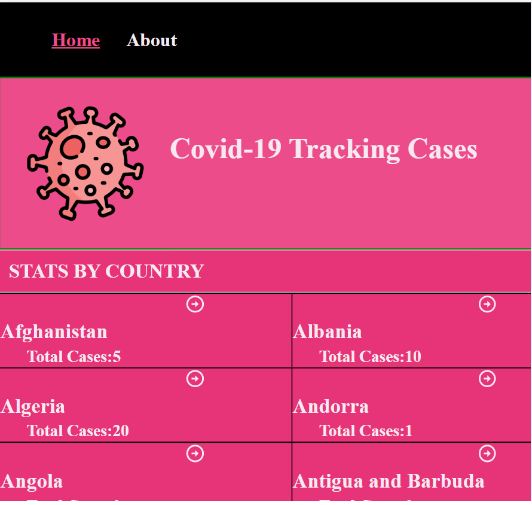

# COvid-19 Tracking Data App

> Covid-19 Tracking Data App:This is a mobile web application to check the data on the total covid19 confirmed cases and deaths, check data for all countries with recorded cases. It also has a details page to check for the statistics for each region/state if available.

## Built With

- React

## Live Demo ()

## Getting Started

To get a local copy up and running follow these simple example steps.

### Prerequisites

- node and npm

### Setup

- git clone repo

### Install

- npm install

### Usage

- localhost:3000

### Run tests

npm run test

### Deployment

## Author

👤 **Ifza Rasool**

- GitHub: [@IfzaRasool](https://github.com/IfzaRasool)

## 🤝 Contributing

Contributions, issues, and feature requests are welcome!

Feel free to check the [issues page](../../issues/).

## Show your support

Give a ⭐️ if you like this project!

## Acknowledgments

- Hat tip to anyone whose code was used
- Inspiration
- etc

## 📝 License

This project is [MIT](./MIT.md) licensed.
